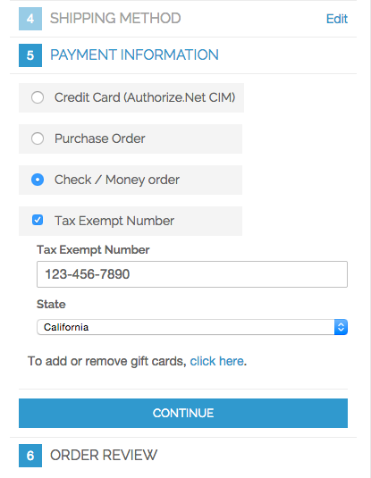
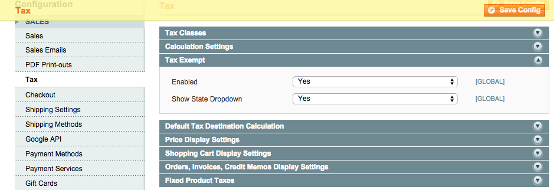

TaxExempt
=========
Customer sets a tax exemption number and removes sales tax calculation from the total.

Description
-----------
One the One Page Checkout, customer can set a tax exemption number and select a state in
the Payment Information tab. This will cause the tax calculation to be bypassed. Note, 
you are responsible for collecting all taxes as set by law.

 

Installation Instructions
-------------------------
Upload files to root of your Magento install. Configure the extension in the 
admin in System -> Configuration -> Sales -> Tax -> Tax Exempt. Enable the 
extension and set optional configuration.

 
